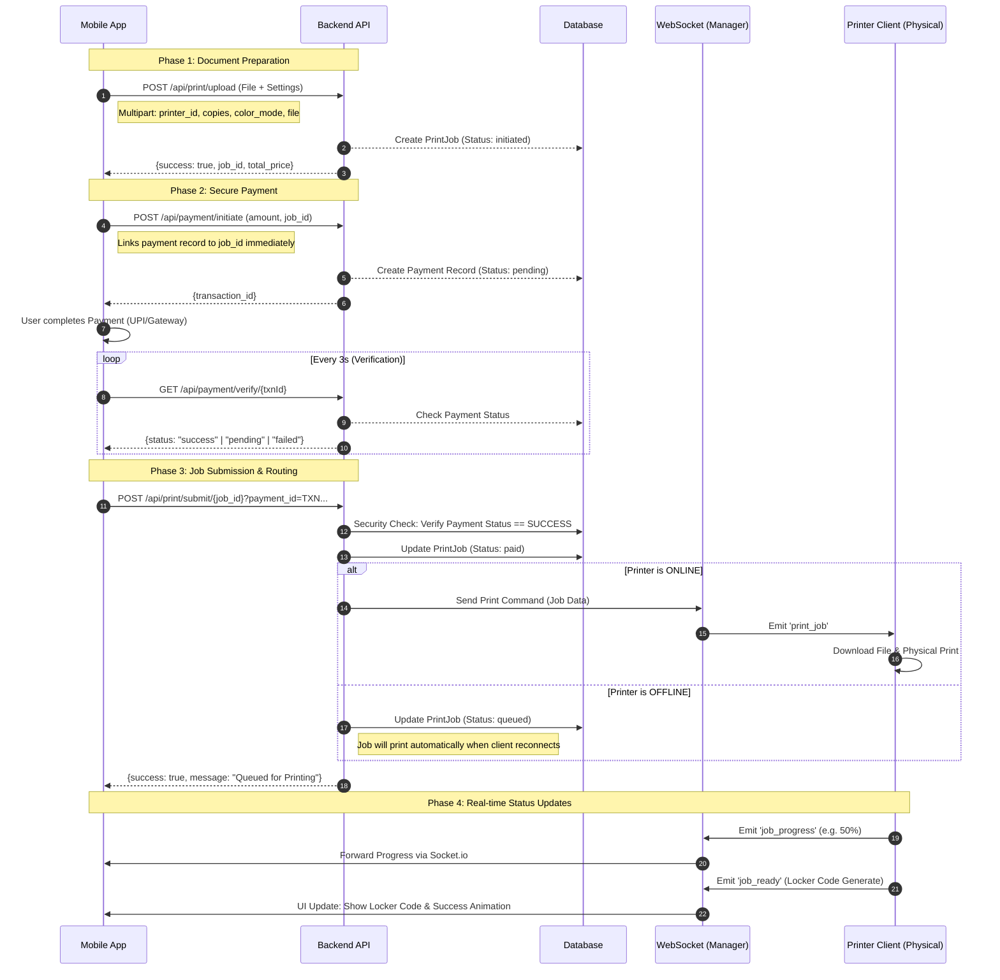

# JusPrint System: Core API & Data Flow

This document details the synchronized flow between the Mobile App, Backend API, and Physical Printer clients. It follows a strict **Security-First** approach where documents are staged, payments are verified, and print commands are only issued upon validated successfully transactions.

---

## 1. System Architecture Diagram

This flowchart represents the end-to-end lifecycle of a print job, from local file selection to physical locker pickup.

---

## 2. API Endpoint Specifications

### Phase 1: Upload (Staging)
| Method | Endpoint | Data Sent | Data Received |
| :--- | :--- | :--- | :--- |
| `POST` | `/api/print/upload` | `multipart/form-data`: `file`, `printer_id`, `settings` | `job_id`, `total_price` |

### Phase 2: Payment (Verification)
| Method | Endpoint | Data Sent | Data Received |
| :--- | :--- | :--- | :--- |
| `POST` | `/api/payment/initiate` | `job_id`, `amount`, `payment_method` | `transaction_id` |
| `GET` | `/api/payment/verify/{id}` | `transaction_id` (in URL) | `status` (success/pending/failed) |

### Phase 3: Submission (Execution)
| Method | Endpoint | Data Sent | Data Received |
| :--- | :--- | :--- | :--- |
| `POST` | `/api/print/submit/{jobId}` | `job_id`, `payment_id` | `success: boolean` |

---

## 3. Real-time WebSocket Listeners (Socket.io)

The app listens for the following events to provide a "live" experience:

1.  **`job_queued`**: Backend acknowledges the job and printer is assigned.
2.  **`job_printing`**: Physical printer has started processing the document.
3.  **`job_progress`**: Carries `{progress: 0-100}` for the live percentage bar.
4.  **`job_ready`**: Carries `{locker_code}`. Final state of the flow.

---

## 4. Error Handling Logic
- **Upload Timeout**: Retry with exponential backoff or check file size limits.
- **Payment Verification Timeout**: Poll for 60 seconds. If still pending, redirect user to History page to track later.
- **Submit Failure**: If payment is successful but submission fails, the `job_id` and `txn_id` are logged to allow for manual admin intervention.

---
*Last Updated: December 22, 2025*
